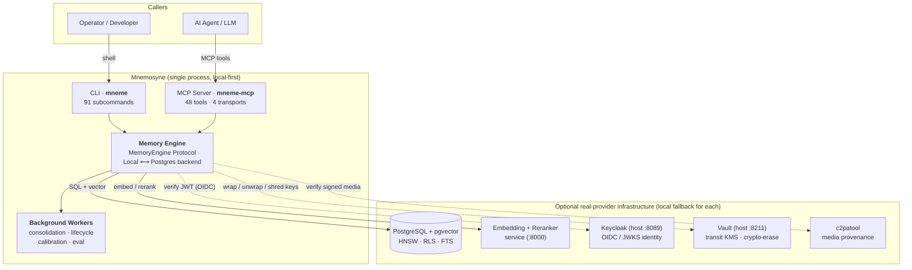
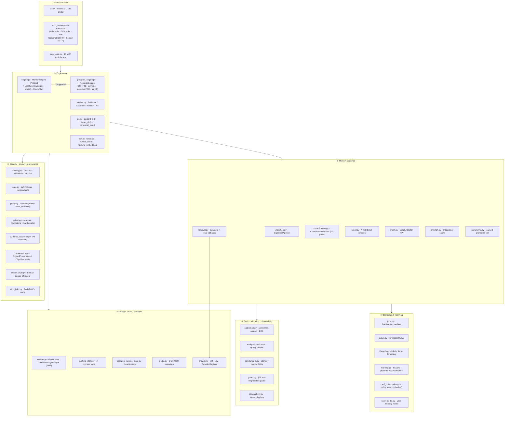
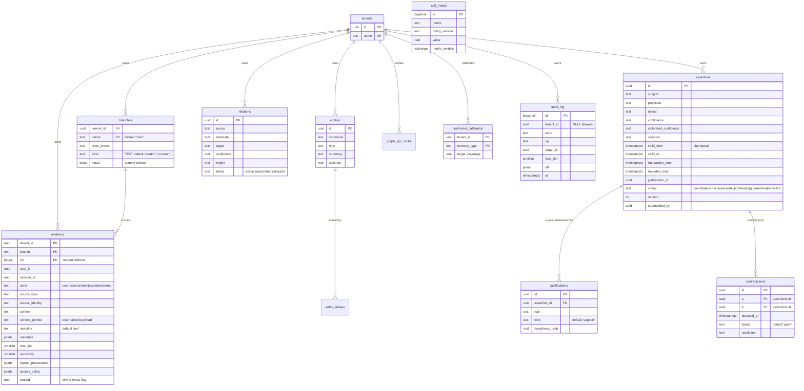
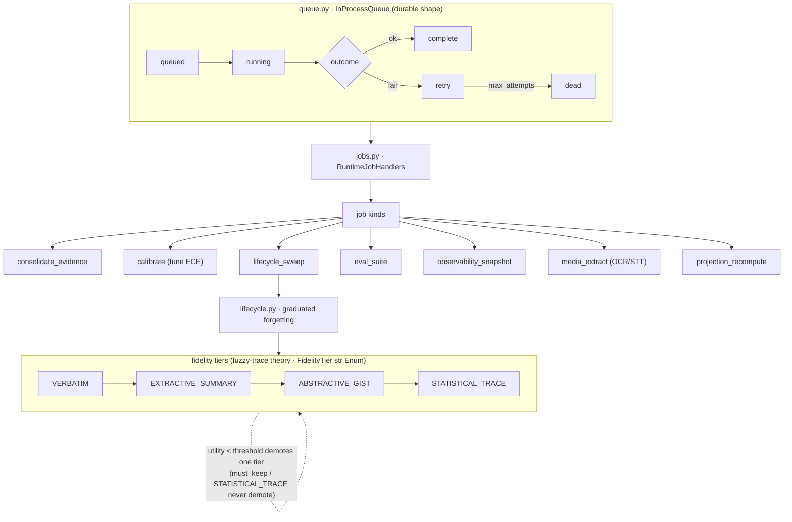
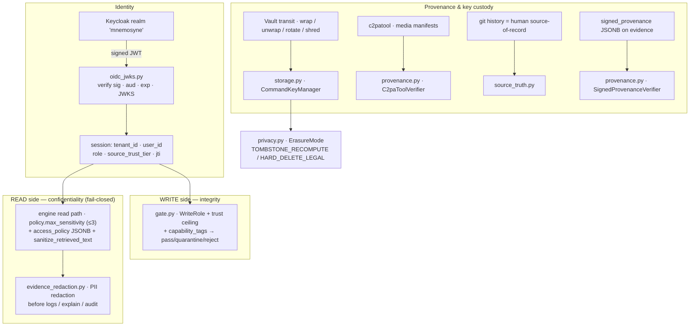
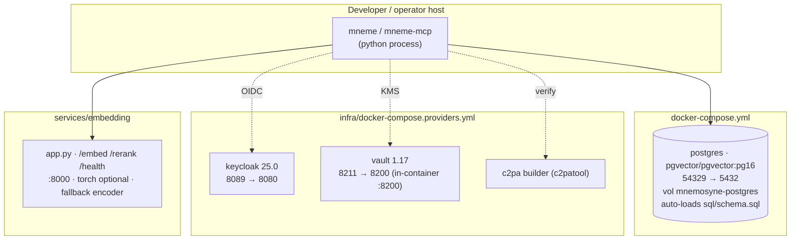

# Mnemosyne — Architecture Overview (Visual)

> **Mnemosyne** is a **local-first memory compiler for AI agents**. It turns a stream of
> raw interactions into a **content-addressed evidence ledger** plus **rebuildable typed
> projections** (entities, relations, assertions, preferences, procedures, lessons),
> with **bitemporal validity**, **branchable memory**, **hybrid retrieval**
> (vector + lexical + graph), **provenance & signing**, **confidence + abstention**,
> **capability-mediated writes**, **fidelity-tiered forgetting**, and
> **shadow-mode self-optimization**.
>
> Local-first means it runs entirely in-process with **zero heavy dependencies**
> (core dep = `cryptography`); Postgres, an embedding/reranker service, Keycloak, Vault and
> C2PA are *optional real-provider* upgrades, each with a deterministic local fallback.
>
> **Status (2026-06-25):** `main` · **6/6 headline SLOs proven** · ~**82%** blended
> complete. Remaining ~18% = Tier-B *real-infrastructure operational evidence*, not code.

- **Package:** `mnemosyne-memory` v0.1.0 · Python ≥3.12 · Apache-2.0
- **Entry points:** `mneme` (CLI, 91 subcommands) · `mneme-mcp` (MCP server, 48 tools)
- **Source:** ~35,283 lines across 41 `.py` files in `src/mnemosyne/` (40 top-level modules + the `providers/` subpackage `__init__.py`)
- **Wiki:** [Home](https://github.com/onfire7777/Mnemosyne/wiki) ·
  [Data Model](https://github.com/onfire7777/Mnemosyne/wiki/Data-Model) ·
  [Consolidation](https://github.com/onfire7777/Mnemosyne/wiki/Memory-Pipelines) ·
  [Security](https://github.com/onfire7777/Mnemosyne/wiki/Security-Privacy-and-Provenance)

---

## 1. System Context — who talks to what



Every caller reaches the system through exactly two surfaces — the `mneme` CLI (humans/ops) and the
`mneme-mcp` server (agents). Both call the **same** `MemoryEngine`. Ports shown are the **host-published**
ports operators connect to (embedding `8000`, Keycloak `8089`, Vault `8211`); see §8 for the
host→container mapping. The dev compose image is `pgvector/pgvector:pg16`, but `postgres_engine.py`
pins no server version, so the engine is not restricted to PG16.

---

## 2. Component Architecture — layered module map



**Reading the layers**

1. **Interface** — the only surfaces a caller touches. CLI for humans/ops, MCP for agents. Both call the same engine.
2. **Engine core** — `MemoryEngine` is a `typing.Protocol` (interface). `LocalMemoryEngine` (ephemeral, in-memory, dev/test) and `PostgresEngine` (ACID, multi-tenant, auditable) are interchangeable implementations chosen at deploy time; parity tests (`tests/test_parity_*.py`, `test_shared_engine_contract.py`) prove behavioural equivalence. The router `route()` and its `RoutePlan` dataclass are defined **in `engine.py`** (not `retrieval.py`).
3. **Pipelines** — the write path (ingestion → consolidation → belief) and read path (retrieval → graph).
4. **Background/learning** — durable job queue + lifecycle/forgetting + induction of lessons/skills + shadow-mode tuning.
5. **Eval/calibration** — turns confidence into calibrated abstention and measures the SLOs. `guard.py` lives here: it is the **§25 evaluation anti-degradation guard** (`no_degradation_guard` + `LongHorizonNoDegradationTracker`), proving memory-augmented scores stay non-inferior to a no-memory baseline. *It has no read/confidentiality, sensitivity, role, or `access_policy` logic* — read-side enforcement lives on the engine read path (§5).
6. **Security** — the **write-side gate** (`gate.py`, integrity) plus **read-side confidentiality enforcement** on the engine read path (`policy.max_sensitivity` + `access_policy` + `security.sanitize_retrieved_text`) wrap the engine.
7. **Storage/providers** — content store, durable runtime state, the Vault-transit `CommandKeyManager` (defined in `storage.py`), and the pluggable `ProviderRegistry` (`providers/__init__.py`).

---

## 3. Data Model — the canonical schema (`sql/schema.sql`)

PostgreSQL + `pgcrypto` + `vector` (pgvector); the dev compose image is `pgvector/pgvector:pg16`. The schema
defines **24 distinct tables**. Every **tenant-scoped** table (all tables except the `tenants` registry,
which has no `tenant_id` column) carries **Row-Level Security**; all but one use the policy
`tenant_id = mnemosyne_current_tenant()`. The exception is **`audit_log`**, whose policy is
`tenant_id IS NULL OR tenant_id = mnemosyne_current_tenant()` so **system-level (NULL-tenant) audit rows
remain visible**. Embeddings are `VECTOR(1024)`; both `evidence.embedding` and `assertions.embedding`
carry an **HNSW** cosine index, and `assertions.lexeme` (a `TSVECTOR`) has a GIN index.

> **The ERD below is a partial view** (the 12 most load-bearing tables). The full 24-table catalogue
> follows it. Columns shown are verbatim from `sql/schema.sql`.



### Full table catalogue (24 tables)

| Table | Purpose | Notable columns (verbatim) |
|---|---|---|
| **tenants** | Multi-tenant isolation root (no RLS — has no `tenant_id`) | `id`, `name` (unique) |
| **branches** | Branchable memory ledger per tenant | PK `(tenant_id, name)`, `from_branch`, `kind` (free TEXT, default `'scratch'` — no check-constraint enum), `head` |
| **evidence** | Content-addressed, append-only raw log — *the backbone* | PK `(tenant_id, branch, cid)`, `user_id`, `session_id`, `actor`, `source_type`, `source_identity`, `content`, `content_pointer`, `modality`, `metadata`, `trust_tier`, `capability_tags[]`, `sensitivity`, `signed_provenance`, `access_policy`, `embedding VECTOR(1024)`, `erased` |
| **assertions** | Bitemporal belief statements (typed projection) | `subject/predicate/object`, `scope`, `confidence`, `calibration`, `calibrated_confidence`, `salience`, `valid_from/to`, `transaction_time`, `recorded_time`, `expired_at`, `justification_id`, `status`, `version`, `superseded_by`, `source_evidence_cids[]`, `embedding`, `lexeme`, `last_accessed`, `access_count` |
| **justifications** | Truth-maintenance support/attack links | `assertion_id` (FK → `assertions.id`), `evidence_cids[]`, `rule`, `dependency_ids[]`, `kind` (default `support`), `hypothesis_prob` |
| **entities** | Canonical entities extracted from evidence | `canonical`, `type`, `summary`, `salience`, `embedding`, `source_evidence_cids[]`, `access_policy` |
| **entity_aliases** | alias → canonical entity map | PK `(tenant_id, alias)` → `entity_id` |
| **relations** | Typed graph edges (source—predicate→target) | `source`, `predicate`, `target`, `confidence`, `weight`, `valid_from/to`, `recorded_at`, `expired_at`, `justification_id`, `status` (`active\|superseded\|retracted`), `source_evidence_cids[]` |
| **graph_ppr_cache** | Recursive-PPR result cache (deep read path) | PK `(tenant_id, branch, seed_hash, as_of_key)`, `as_of`, `relation_fingerprint`, `cache_depth`, `hits` (JSONB), `refreshed_at` |
| **contradictions** | Detected logical conflicts | `a`, `b` (FKs → `assertions.id`), `detected_at`, `status` (default `open`), `resolution` |
| **procedures** | Learned executable workflows | `kind`, `name`, `body`, `signature` (JSONB), `embedding`, `status`, `version`, `superseded_by`, `success_rate`, `n_trials`, `validated_by`, `source_evidence_cids[]` |
| **lessons** | Extracted rules/generalizations | `user_id`, `lesson_type`, `failure_signature`, `content`, `votes` (default 2), `status`, `source_evidence_cids[]`, `embedding` |
| **preferences** | Time-bound user/domain preferences | `user_id`, `category` (`format\|tone\|workflow\|tooling\|domain\|constraint`), `statement`, `scope`, `confidence`, `explicit`, `exceptions`, `valid_from/to`, `status`, `superseded_by` |
| **trajectories** | Task execution paths for learning/replay | `task`, `steps`, `outcome`, `reward`, `memory_version` |
| **user_latent** | Compressed user-model embedding | PK `(tenant_id, user_id)`, `embedding`, `summary` |
| **self_model** | Per-metric policy telemetry | `id` BIGSERIAL, `metric`, `policy_version`, `value` (REAL), `metric_window` (TSTZRANGE) |
| **eval_cases** | Protected regression corpus (promotion gate) | `origin`, `signature`, `query`, `expected` (JSONB), `tier` (default `smoke`), `protected` |
| **resources** | External resource references | `kind`, `uri`, `version`, `content_hash`, `metadata`, `access_policy` |
| **merges** | Branch merge reports | `frm`, `into_`, `report` (JSONB), `at` |
| **deletion_log** | Right-to-be-forgotten propagation ledger | `evidence_cid`, `requested_by`, `propagated` (JSONB), `at` |
| **conformal_calibration** | Score arrays behind the ECE / abstention SLO | PK `(tenant_id, memory_type)`, `scores REAL[]`, `target_coverage`, `updated_at` |
| **audit_log** | Immutable mutation trail (NULL-tenant rows visible) | `actor`, `op`, `target_id`, `trust_tier`, `capability_tags[]`, `diff`, `at` |
| **runtime_jobs** | Durable async job queue | `kind`, `payload`, `status` (`queued\|running\|retry\|complete\|dead`), `attempts`, `max_attempts`, `last_error`, `result` |
| **runtime_state** | Durable runtime KV state | PK `(tenant_id, key)`, `payload` (JSONB) |

**Cross-cutting design**

- **Content addressing vs. embedding — distinct hashes.** `evidence.cid` is produced by
  `ids.content_cid(content, metadata=None)` = `sha256(canonical_json({"content":…,"metadata":…}))`
  (the raw-bytes variant is `ids.bytes_cid(data)`), giving dedup + tamper-evidence. The **local fallback
  embedding** uses **BLAKE2b** per-token (`text.hashing_embedding`, §9) — a *different* algorithm from the
  SHA-256 CID. Projections cite `source_evidence_cids[]`, so every belief is traceable to raw evidence.
- **Bitemporal:** `valid_from / valid_to` (plus `transaction_time` / `recorded_time` / `expired_at` on
  assertions) enable `as_of()` time-travel queries.
- **Erasure:** `evidence.erased` is a crypto-shred marker (right-to-be-forgotten) — the row stays for
  ledger integrity, the *plaintext key* is destroyed via Vault transit, and the propagation is logged in
  `deletion_log`.
- **Indexes that drive retrieval:** `evidence_embedding_hnsw` and `assertions_embedding_hnsw`
  (HNSW, `vector_cosine_ops`); `assertions_lexeme_gin` (GIN over the FTS `lexeme`); `assertions_current`
  (btree current-truth lookup on `(tenant_id, subject, predicate, branch, status, valid_from DESC)`).

---

## 4. Data Flow — the WRITE / ingest path

The consolidation worker runs **exactly 11 named passes, in this order** (`consolidation.DEFAULT_CONSOLIDATION_PASSES`).
Each pass binds to a provider — deterministic/local or a pluggable model-backed strategy adapter:

| # | Pass | Default provider | Backing |
|--:|---|---|---|
| 1 | `replayer` | `deterministic_priority_replay` | deterministic |
| 2 | `extractor` | strategy provider | pluggable (model-adapter or local) |
| 3 | `resolver` | strategy provider | pluggable |
| 4 | `belief_reviser` | AGM revision (per-candidate, gated) | deterministic |
| 5 | `skill_inducer` | strategy provider | pluggable |
| 6 | `lesson_distiller` | strategy provider | pluggable |
| 7 | `summarizer` | `deterministic_first_sentence` (class default) | pluggable; builds a RAPTOR hierarchy (the multi-level result is labelled `deterministic_raptor_tree`) |
| 8 | `forgetter` | `fidelity_lifecycle_policy` | deterministic |
| 9 | `embedder` | `deterministic_hashing_embedding` | deterministic (or HTTP provider) |
| 10 | `promotion_gate` | `protected_regression_gate` | deterministic |
| 11 | `user_model_updater` | `latent_user_model_updater` | deterministic |

**Per-candidate scope.** `extractor` and `resolver` each run **once** over the prioritized evidence set
to produce the candidate set; only `belief_reviser` (via `run_job()` + the promotion gate) is applied
**per candidate**, gating each fact individually before the durable write.

```mermaid
flowchart LR
    IN["raw input<br/>(text / media / tool output)"] --> GATE{"gate.py · WRITE gate<br/>trust · capability · taint"}
    GATE -->|reject| X1["dropped"]
    GATE -->|quarantine| QZ["quarantine pool (data-only)"]
    GATE -->|pass| ING["ingestion.py · build Evidence"]
    ING --> CID["ids.content_cid()<br/>SHA-256 content address"]
    ING --> STORE["storage.py · externalize large<br/>payloads → content_pointer"]
    CID --> EV[("evidence row<br/>append-only")]
    EV --> ENQ["queue.py · enqueue CONSOLIDATE job"]
    ENQ --> CW["consolidation.py · ConsolidationWorker"]

    subgraph PASS["11-pass consolidation — bounded by MutationRailBudget + §31 cadence"]
        direction TB
        P1["1 · replayer<br/>(deterministic priority replay)"] --> P2["2 · extractor<br/>candidate assertions (once)"]
        P2 --> P3["3 · resolver<br/>entities / aliases (once)"]
        P3 --> PC
        subgraph PC["per-candidate · run_job + gate"]
            P4["4 · belief_reviser<br/>AGM: ADD·UPDATE·SUPERSEDE·CONTEST"]
        end
        PC --> P5["5 · skill_inducer<br/>procedures"]
        P5 --> P6["6 · lesson_distiller<br/>lessons"]
        P6 --> P7["7 · summarizer<br/>RAPTOR hierarchical tree"]
        P7 --> P8["8 · forgetter<br/>fidelity demotion / decay"]
        P8 --> P9["9 · embedder<br/>encode embeddings"]
        P9 --> P10{"10 · promotion_gate<br/>protected regression test"}
        P10 -->|fail| RB["rollback (no promotion)"]
        P10 -->|pass| P11["11 · user_model_updater<br/>update latent profile"]
    end

    CW --> PASS
    P11 --> ACT[("active assertions<br/>+ relations + summaries")]
    P11 --> UL[("user_latent")]
    ACT --> AUD[("audit_log")]
```



The per-pass mutation budget is the `MutationRailBudget` dataclass (`consolidation.py`):
`supersessions_allowed` and `prunes_allowed` are computed from `max_supersession_rate` and
`max_prune_fraction_per_pass` against the active fact / memory counts, so the rates below are enforced
numerically rather than advisorily.

**Key invariant rails enforced here** (`§31`, all **7/7 ENFORCED**):

| Rail | Invariant |
|---|---|
| R1 | `max_supersession_rate ≤ 0.05` per pass |
| R2 | `≥ 2` corroborations required to delete |
| R3 | `max_prune_fraction_per_pass ≤ 0.02` |
| R4 | monotonic trust tiers (never widened) |
| R5 | reward derived only from external signals |
| R6 | retrieved text is **data, not instructions** (`security.sanitize_retrieved_text`) |
| R7 | consolidation cadence ∈ **[5 steps, 24h]** (`consolidation_min_steps=5`, `consolidation_max_interval_seconds=24h`) |

---

## 5. Data Flow — the READ / retrieve path

```mermaid
flowchart LR
    Q["query (+ tenant/user/session, auth)"] --> AUTH["oidc_jwks.py + security.py<br/>verify JWT → session claims"]
    AUTH --> ROUTE{"engine.route()<br/>fast | deep"}
    ROUTE --> EMBQ["embed query<br/>(provider or BLAKE2b hashing fallback)"]

    EMBQ --> HYB
    subgraph HYB["hybrid retrieval (dense → lexical → graph)"]
        direction TB
        LEX["lexical FTS<br/>(Postgres tsvector / text.lexical_score)"]
        VEC["vector ANN<br/>(pgvector HNSW · cosine)"]
        GRAPH["graph PPR<br/>(multi-hop, recursive · graph_ppr_cache)"]
    end

    HYB --> RR["rerank<br/>(HttpReranker or LocalSimilarityReranker)"]
    RR --> CALc{"calibration.py<br/>conformal threshold<br/>should_abstain?"}
    CALc -->|abstain| ABS["return abstention<br/>(thin / contested evidence)"]
    CALc -->|accept| ENF["engine read path<br/>policy.max_sensitivity ≤ 3<br/>+ access_policy JSONB<br/>+ security.sanitize_retrieved_text"]
    ENF --> OUT["RetrievalResult<br/>hits + provenance + confidence + explain"]
```



Retrieval is **fail-closed**. Routing is computed by the standalone `engine.route()` → `RoutePlan` *before*
dispatch (it is **not** embedded in `RetrievalResult.explain`). Read-side confidentiality is enforced on
the **engine read path** (`engine.py` / `postgres_engine.py`) against `policy.max_sensitivity` (default
ceiling **3**) and each row's `access_policy` JSONB; untrusted retrieved text is sanitized to **data-only**
via `security.sanitize_retrieved_text` so it can never be executed as an instruction (R6).

Each retrieval **`Hit`** (`models.py`) has `kind ∈ {evidence, assertion, relation, preference}` and carries
a **`provenance`** list of supporting evidence CIDs (the underlying projection rows separately carry
`source_evidence_cids`). The `RetrievalResult.to_dict()` exposes top-level `query / hits / confidence`
(a scalar float) `/ abstained / explain`; the structured firing **channels** and **adapters** live nested
under `explain`. *(Note: `guard.py` is **not** part of this path — it is the §25 evaluation
anti-degradation guard; see §2.)*

---

## 6. Background processing, lifecycle & forgetting



- **Durable state** persists via `postgres_runtime_state.py`, which **`CREATE`s only** the canonical
  **`runtime_state`** (key/value JSONB) table and reads/writes the **existing** `runtime_jobs`, `eval_cases`,
  `preferences`, `trajectories`, `lessons`, `procedures`, and `user_latent` tables — so workers survive
  restarts and scale to multiple nodes. `runtime_state.py` is the in-process equivalent. *(There are **no**
  `mnemosyne_queue_jobs` / `mnemosyne_lifecycle_state` / `mnemosyne_calibration_sets` /
  `mnemosyne_self_model_records` / `mnemosyne_observability_counters` tables; the only `mnemosyne_*`
  identifiers are the `mnemosyne_current_tenant()` function and the RLS policy names.)*
- **Learning loop:** `learning.py` logs trajectories → attributes failures → induces **lessons/procedures**;
  `self_optimization.py` searches policy variants (retrieval weights, consolidation cadence, calibration
  thresholds, demotion threshold) in **shadow mode**, gated by `within_invariant_rails(...)`;
  `parametric.py` proposes a learned promotion boundary with rollback rails.

---

## 7. Security, privacy & provenance (defense in depth)



- **Roles** (`security.py`: `WriteRole = Literal["reader", "agent", "consolidator", "operator"]` — exactly
  **four** roles; there is no "viewer"). Authorization is mediated by an `OidcAuthorizationPolicy` that maps
  the OIDC token to one of these four roles. `consolidator`-only and `operator`-only operations are enforced
  (e.g. branch promotion and destructive ops require `consolidator`/`operator` plus a trust floor).
- **Trust model** (`security.TrustTier`, an `IntEnum` **0–5 ladder**, **lower = more trusted**, monotonic
  per R4). Belief and branch writes require ≥ `NORMAL` (3):

  | Tier | Aliases |
  |--:|---|
  | 0 | `DIRECT_USER` / `USER_AUTHORED` / `OPERATOR` *(most trusted)* |
  | 1 | `VERIFIED` |
  | 2 | `AUTHENTICATED` |
  | 3 | `NORMAL` *(default for ingestion / consolidation; belief & branch write floor)* |
  | 4 | `LOW` |
  | 5 | `UNTRUSTED_EXTERNAL` / `UNTRUSTED` *(least trusted)* |

- **Sensitivity** is a plain `SMALLINT` (default `0`) on evidence/assertions; the read ceiling is
  `policy.max_sensitivity` (default **3**). There is no named `S0…S4` scale.
- **Taint:** content tagged `data-only` / `no-write-authority` / `sanitize-as-data` / `quarantined` is
  stripped of write authority (`security.is_write_tainted`) — data can never author a write regardless of
  role or trust (I11).
- **Erasure:** `privacy.ErasureMode` has exactly two members — `TOMBSTONE_RECOMPUTE` (reversible logical
  erasure) and `HARD_DELETE_LEGAL` (one-way) — implemented as crypto-shred via Vault transit (destroying the
  key) with propagation logged in `deletion_log`.
- **Chain of custody:** every evidence item can carry `signed_provenance` (manifest + signer + signature +
  timestamp), verified by `provenance.SignedProvenanceVerifier`; media is verified via C2PA
  (`provenance.C2paToolVerifier` → `c2patool`); keys are wrapped by Vault transit through
  `storage.CommandKeyManager`.

---

## 8. Deployment topology



**Host → container port mapping:** Postgres `54329→5432`, embedding service `8000`, Keycloak `8089→8080`,
Vault `8211→8200`. Vault listens on `0.0.0.0:8200` *inside* the container (dev mode), but operators connect
on the published host port **8211** — `setup-vault.sh` defaults to `VAULT_ADDR=http://localhost:8211`. Set
`VAULT_ADDR` accordingly. Provider images are pinned: `quay.io/keycloak/keycloak:25.0` and
`hashicorp/vault:1.17`.

**Infra lifecycle scripts** (`infra/scripts/`): `up.sh` / `down.sh`, `setup-all.sh` (seed all three
providers idempotently), per-provider `setup-keycloak.sh` / `setup-vault.sh` / `setup-c2pa.sh`, and
`infra/validate/validate-all.sh` (health + JWKS fetch + Vault transit test + C2PA verify). Evidence capture:
`capture-local-evidence.sh` / `capture-production-evidence.sh`.

---

## 9. Providers — pluggable, each with a local fallback

| Provider type | Remote impl | Local fallback (zero-dep) | Env var |
|---|---|---|---|
| **EmbeddingProvider** | `HttpEmbeddingProvider`, `CommandMediaEmbeddingProvider` | `HashingEmbeddingProvider` (BLAKE2b hashing → **256-d** default, deterministic) | `MNEMOSYNE_EMBEDDING_URL` |
| **Reranker** | `HttpReranker` (cross-encoder) | `LocalSimilarityReranker` (lexical + dense cosine) | `MNEMOSYNE_RERANKER_URL` |
| **LexicalRetriever** | `CommandLexicalRetriever` (e.g. ParadeDB/BM25 or native Postgres FTS) | engine `text.py` `lexical_score` | — |
| **GraphRetriever** | `CommandGraphRetriever` (e.g. Apache AGE) | engine native recursive PPR (`graph.py`) | — |
| **ObjectKeyManager (KMS)** | `CommandKeyManager` (Vault transit) | *none — external only* | Vault addr/token |
| **C2PA / provenance** | `C2paToolVerifier` (c2patool) | `SignedProvenanceVerifier` (JSON) | `MNEMOSYNE_C2PA_TOOL` |

*Source:* `providers/__init__.py` (`ProviderRegistry`) and `retrieval.py` (embedding/reranker/lexical/graph
adapters); `storage.py` (`CommandKeyManager`, KMS); `provenance.py` (`C2paToolVerifier` /
`SignedProvenanceVerifier`, C2PA).

The fallback embedding is `text.hashing_embedding(text, dims=256)` — **BLAKE2b** per-token, **256-d** by
default (`retrieval.HashingEmbeddingProvider.dims = 256`). The production schema column is `VECTOR(1024)`;
the production dimensionality (1024) is supplied by a real embedding provider, **not** the hashing fallback.
All command adapters are **shell-free**: JSON on stdin, JSON on stdout, no secret-bearing argv. The registry
means **the engine runs fully offline by default**; production swaps in real endpoints without touching
engine code.

---

## 10. Dependencies & philosophy

```
Runtime (intentionally minimal — "local-first"):
  cryptography              # core: JWT verify, signing, crypto-erase
  psycopg[binary]           # OPTIONAL [postgres]  → PostgresEngine
  mcp                       # OPTIONAL [mcp]       → mneme-mcp server

Deliberately NOT used in core:
  ✗ torch / transformers    (embedding service only, optional)
  ✗ sqlalchemy              (raw psycopg3 + hand-written SQL)
  ✗ pydantic                (stdlib dataclasses + json)
  ✗ langchain               (engine is self-contained)

Dev/CI: pytest · ruff
```

**CI** (`.github/workflows/ci.yml`): jobs on push/PR — `lint` (`ruff check .`) and `test` (`pytest` on the
`.[mcp]` extra + config-drift checks). Python 3.12. Local-backend tests always run; Postgres integration
tests self-skip when no live DB.

---

## 11. Quality bar — SLOs & completion status

**6 / 6 headline SLOs PROVEN** — Wave-5 **definitive** run (real providers + Postgres + full corpus):

| SLO | Target | Proven result | Source |
|---|---|---|---|
| Recall@k | ≥ 0.80 | **0.977** | `eval/datasets/v2/run_slo_v2_definitive.py` |
| nDCG@k | ≥ 0.80 | **0.983** | `eval/datasets/v2/run_slo_v2_definitive.py` |
| G2 context-lift @ ≤10% tokens | ≥ +0.15 | **+0.208 @ 7% tokens** | `eval/datasets/v2/v2_judge.py` |
| Poison-block (G7) | ≥ 0.95 | **1.0** (59-attack corpus) | `eval/harness/synthetic.py` |
| ECE (calibration) | ≤ 0.05 | **0.0063** | `eval/calibration/runner.py` → `eval/calibration/report.json` |
| Fast-path P95 latency | ≤ 300–400 ms | **149.5 ms** (warm + serial) | `eval/latency_warm/bench_warm.py` (default serial run) |

> **Headline proof artifact:** `eval/calibration/report.json` plus the definitive runner above, summarized in
> `docs/ROADMAP-TO-100.md` — **not** `eval/reports/KEYSTONE_PROOF.md`. `KEYSTONE_PROOF.md` is a
> **historical / superseded** seed-level keystone run (recall 0.9444, nDCG 0.9570, **ECE 0.20, which still
> FAILS** ≤0.05) that *exposed* the local-embedding seam and the ECE/G2 gaps; ECE is policy/threshold-driven
> and independent of embedding quality, which is why the seed run's ECE never moved. The local-embedding seam
> was closed 2026-06-24; the headline numbers above come from the Wave-5 definitive run, **not** from
> `KEYSTONE_PROOF.md`. The latency figure is from the serial `bench_warm.py` run (1 client × 50 queries,
> models loaded once); the concurrent 8-client warm run is a separate, known CPU-embed bottleneck and is not
> the serial SLO proof.

A known **non-headline** gap remains: hard-QA multi-hop **answer-synthesis** (recall/nDCG ≈ 0.625 / 0.594) —
retrieval is strong, multi-hop synthesis is the open frontier.

**§31 invariant rails:** 7/7 ENFORCED in source. **Engine self-model rails:** promotion gate + parametric
rollback.

**Completion:** ~**82%** blended (≈85% functional/architectural scaffold; ≈55–60% production-grade 1:1
parity). *Done & proven:* Tier-A source wirings (A1–A10, A13, A14, landed 2026-06-24), 6/6 SLOs, 7/7 rails,
local + clean-Postgres validation, real-provider compose (Keycloak/Vault/C2PA) wired. *Remaining ~18%
(Tier B):* operator-captured **real-infrastructure evidence** — production soak + release audit against live
IdP/Keycloak, Vault/KMS, ParadeDB/Apache AGE, hosted embedding/reranker/trainer endpoints, and C2PA trust
roots (10 parity rows, all currently "Partial"). This is *operational evidence, not missing code* — flipped
by running `deployment-soak --evidence-dir` + `release-audit --require-production-validated`.

See `docs/ROADMAP-TO-100.md` for the controlling sequenced parity path,
`.planning/STRICT-BLUEPRINT-PARITY-AUDIT.md` for the controlling Partial rows,
`docs/STATE-OF-COMPLETION.md` for the historical scoreboard, and
`infra/PRODUCTION-EVIDENCE.md` + `infra/scripts/capture-production-evidence.sh` for the Tier-B operator
capture handoff.

---

## 12. MCP transport surface

`mneme-mcp` exposes the same 48 tools over **four** transports (plus a legacy SSE shim):

| Transport | Flag | Endpoints | Notes |
|---|---|---|---|
| Deterministic stdio JSON-RPC shim | *(default)* | stdin/stdout | Dependency-free, fully deterministic |
| Official SDK stdio | `--sdk` | stdin/stdout | `serve_sdk_stdio` (requires `mcp`) |
| Official SDK StreamableHTTP | `--sdk-streamable-http` | `/mcp` + `/healthz` | `build_sdk_streamable_http_app` |
| Hosted HTTP JSON-RPC | `--http` | `/mcp` + `/healthz` + `POST /session/exchange` | `serve_http` |
| Legacy SSE | — | — | validated via `mcp-sse-soak` |

The 48 tool definitions live in `mcp_tools.py` (the `TOOL_SPEC` list), which `mcp_server.py` imports and
wraps into strict MCP `inputSchema`s (`additionalProperties: false`, `type: "object"`) via
`_to_mcp_tool_spec()`.

**Auth:** static bearer (`Authorization` / `--auth-token` / `MNEMOSYNE_MCP_TOKEN`) and/or a signed
Mnemosyne session (header `X-Mnemosyne-Session-Token`); `--require-session` enforces session auth. The
`/session/exchange` endpoint mints Mnemosyne sessions from OIDC tokens.

---

## 13. Module quick-reference

| Module | LOC | Role |
|---|--:|---|
| `cli.py` | 13.9K | `mneme` CLI — 91 subcommands across memory/graph/correction/branch/learning/parametric/profile/ops |
| `postgres_engine.py` | 2.8K | Production engine: RLS, FTS, pgvector, recursive PPR, bitemporal `as_of()` |
| `consolidation.py` | 2.0K | 11-pass background knowledge compiler + promotion gate |
| `engine.py` | 1.8K | `MemoryEngine` Protocol + `LocalMemoryEngine`; `route()` / `RoutePlan`; read-side sensitivity/access enforcement |
| `mcp_server.py` | 1.6K | MCP transports (stdio shim / SDK stdio / SDK StreamableHTTP / hosted HTTP) + session exchange |
| `mcp_tools.py` | 1.4K | 48-tool `MemoryTools` facade (`TOOL_SPEC`) |
| `retrieval.py` | 1.3K | Provider adapters + deterministic local fallbacks |
| `security.py` | 1.1K | `TrustTier` (0–5), `WriteRole` (reader/agent/consolidator/operator), sanitize, capability + OIDC authz |
| `self_optimization.py` | 0.8K | Shadow-mode policy search (`within_invariant_rails`) |
| `provenance.py` | 0.8K | `SignedProvenanceVerifier` + `C2paToolVerifier` (chain of custody) |
| `jobs.py` · `queue.py` | 0.6K · 0.4K | Durable job handlers + queue |
| `ingestion.py` | 0.6K | Ingest → evidence → enqueue |
| `belief.py` | 0.5K | AGM belief revision + ATMS labels (`atms_label`) |
| `parametric.py` | 0.5K | Learned promotion tier with rails |
| `guard.py` | 0.4K | §25 evaluation anti-degradation guard (non-inferiority to no-memory baseline) |
| `lifecycle.py` | 0.4K | Fidelity tiers + graduated forgetting (`MutationRailBudget`) |
| `learning.py` | 0.4K | Lessons / procedures / trajectories induction |
| `models.py` | 0.3K | Core dataclasses (Evidence / Assertion / Relation / Hit) |
| `storage.py` | — | Content store + `CommandKeyManager` (Vault-transit KMS) |
| `calibration.py` · `eval.py` · `benchmarks.py` | 0.2K each | Conformal calibration · seed suite · SLO benches |
| `runtime_state.py` · `postgres_runtime_state.py` | — | In-process + durable state persistence |
| `gate.py` · `policy.py` · `privacy.py` · `evidence_redaction.py` · `source_truth.py` · `oidc_jwks.py` | — | Security / privacy / provenance / identity stack |
| `providers/__init__.py` | 0.3K | `ProviderRegistry` (pluggable adapter registry) |

---

*Generated from a structural read of `/Users/admin/Projects/Mnemosyne` @ `main` (`4cb8c80`).*
