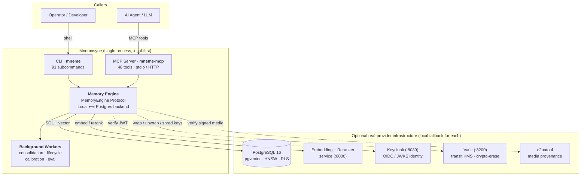
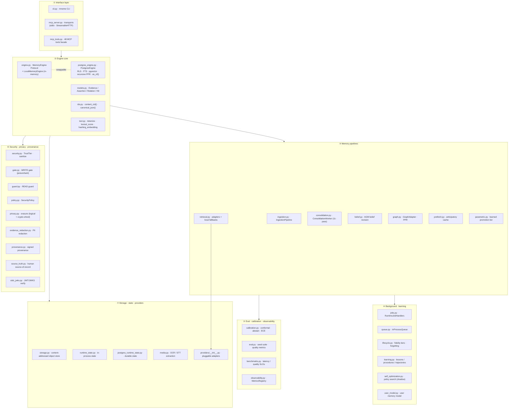
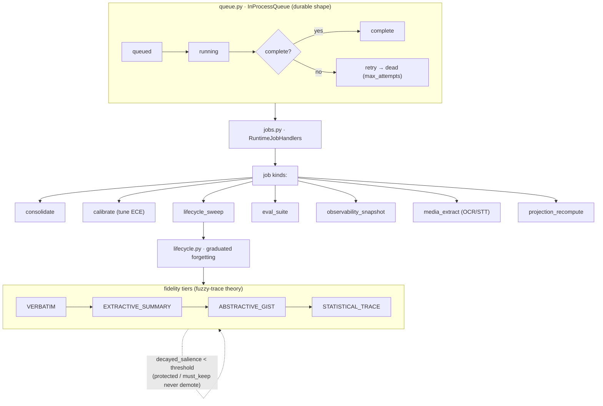
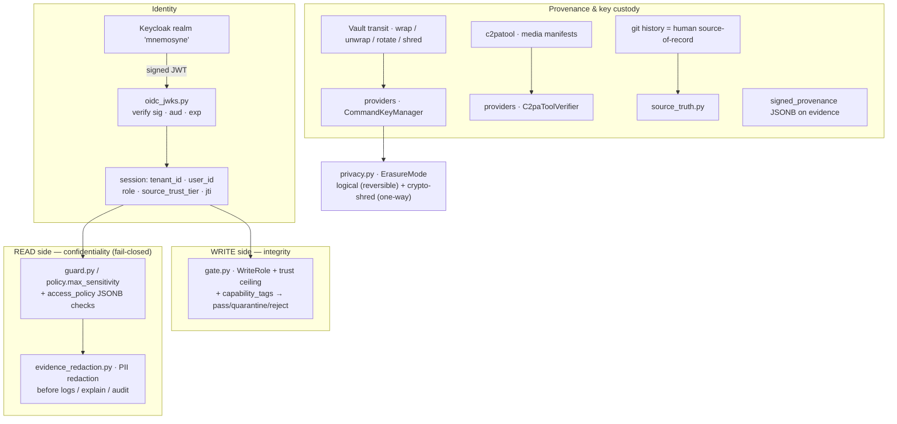
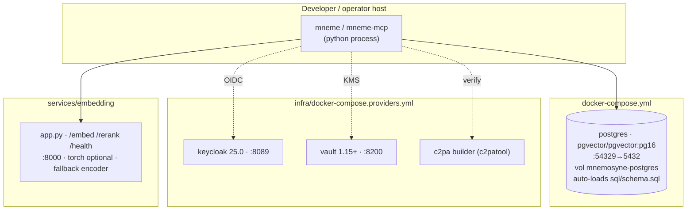

# Mnemosyne — Architecture Overview (Visual)

> **Mnemosyne** is a **local-first memory compiler for AI agents**. It turns a stream of
> raw interactions into a **content-addressed evidence ledger** plus **rebuildable typed
> projections** (entities, relations, assertions, preferences, procedures, lessons),
> with **bitemporal validity**, **branchable memory**, **hybrid retrieval**
> (vector + lexical + graph), **provenance & signing**, **confidence + abstention**,
> **capability-mediated writes**, **fidelity-tiered forgetting**, and
> **shadow-mode self-optimization**.
>
> Local-first means it runs entirely in-process with **zero heavy dependencies**
> (core dep = `cryptography`); Postgres, an embedding service, Keycloak, Vault and
> C2PA are *optional real-provider* upgrades, each with a deterministic local fallback.
>
> **Status (2026-06-25):** `main` · **6/6 headline SLOs proven** · ~**82%** blended
> complete. Remaining ~18% = Tier-B *real-infrastructure operational evidence*, not code.

- **Package:** `mnemosyne-memory` v0.1.0 · Python ≥3.12 · Apache-2.0
- **Entry points:** `mneme` (CLI, 91 subcommands) · `mneme-mcp` (MCP server, 48 tools)
- **Source:** ~35K LOC across ~40 modules in `src/mnemosyne/`

---

## 1. System Context — who talks to what



---

## 2. Component Architecture — layered module map



**Reading the layers**
1. **Interface** — the only surfaces a caller touches. CLI for humans/ops, MCP for agents. Both call the same engine.
2. **Engine core** — `MemoryEngine` is a *Protocol* (interface). `LocalMemoryEngine` (ephemeral, O(n), dev/test) and `PostgresEngine` (ACID, multi-tenant, auditable) are interchangeable implementations chosen at deploy time.
3. **Pipelines** — the write path (ingestion→consolidation→belief) and read path (retrieval→graph).
4. **Background/learning** — durable job queue + lifecycle/forgetting + induction of lessons/skills + shadow-mode tuning.
5. **Eval/calibration** — turns confidence into calibrated abstention; measures the SLOs.
6. **Security** — write-side gate (integrity) and read-side guard (confidentiality) wrap the engine.
7. **Storage/providers** — content store, durable runtime state, and the pluggable provider registry (embedding/reranker/graph/lexical/KMS/C2PA).

---

## 3. Data Model — the canonical schema (`sql/schema.sql`)

PostgreSQL 16 + `pgcrypto` + `vector` (pgvector). Every tenant-aware table has **Row-Level Security** keyed on `mnemosyne_current_tenant()`. Embeddings are `VECTOR(1024)`; `evidence.embedding` has an **HNSW** cosine index.

```mermaid
erDiagram
    tenants ||--o{ branches : owns
    tenants ||--o{ evidence : owns
    branches ||--o{ evidence : contains
    tenants ||--o{ entities : owns
    entities ||--o{ entity_aliases : "aliased by"
    tenants ||--o{ relations : owns
    tenants ||--o{ assertions : owns
    tenants ||--o{ preferences : owns
    tenants ||--o{ contradictions : owns
    tenants ||--o{ procedures : owns
    tenants ||--o{ lessons : owns
    tenants ||--o{ trajectories : owns
    tenants ||--o{ user_latent : owns
    tenants ||--o{ self_model : owns
    tenants ||--o{ runtime_jobs : owns
    tenants ||--o{ runtime_state : owns
    tenants ||--o{ audit_log : owns

    tenants {
        uuid id PK
        text name UK
    }
    branches {
        uuid tenant_id PK_FK
        text name PK
        text from_branch
        text kind "scratch|merge"
        bytea head "commit pointer"
    }
    evidence {
        uuid tenant_id PK_FK
        text branch PK_FK
        bytea cid PK "content address"
        text actor "user|assistant|tool|system|external"
        text content
        smallint trust_tier
        smallint sensitivity
        text_arr capability_tags
        jsonb signed_provenance
        jsonb access_policy
        vector embedding "1024 · HNSW"
        bool erased "crypto-erase flag"
    }
    assertions {
        uuid id PK
        text subject
        text predicate
        text object
        real confidence
        timestamptz valid_from "bitemporal"
        timestamptz valid_to
        text status "candidate|active|superseded|contested|quarantined"
        text_arr source_evidence_cids
    }
    relations {
        uuid id PK
        text source
        text predicate
        text target
        real confidence
        text status "active|superseded|retracted"
    }
    entities {
        uuid id PK
        text canonical
        real salience
        vector embedding "1024"
    }
    audit_log {
        bigserial id PK
        text action
        text resource_type
        jsonb diff
        smallint trust_tier
    }
```

### Table catalogue

| Table | Purpose | Notable columns |
|---|---|---|
| **tenants** | Multi-tenant isolation root | `id`, `name` (unique) |
| **branches** | Branchable memory ledger per tenant | composite PK `(tenant_id, name)`, `from_branch`, `kind`, `head` |
| **evidence** | Content-addressed, append-only raw log — *the backbone* | PK `(tenant_id, branch, cid)`, `actor`, `trust_tier`, `sensitivity`, `capability_tags[]`, `signed_provenance`, `access_policy`, `embedding VECTOR(1024)`, `erased` |
| **entities** | Canonical entities extracted from evidence | `canonical`, `salience`, `embedding`, `source_evidence_cids[]` |
| **entity_aliases** | alias → canonical entity map | PK `(tenant_id, alias)` → `entity_id` |
| **relations** | Typed graph edges (subject—predicate→object) | `source`, `predicate`, `target`, `confidence`, `valid_from/to`, `status` |
| **assertions** | Bitemporal belief statements (typed projection) | `subject/predicate/object`, `confidence`, `valid_from/to`, `status`, `source_evidence_cids[]` |
| **preferences** | Time-bound user/domain preferences | `category`, `statement`, `scope`, `explicit`, `superseded_by` |
| **contradictions** | Detected logical conflicts | `assertion_id_a/b`, `kind`, `severity`, `status` |
| **procedures** | Learned executable workflows | `steps`, `preconditions`, `postconditions`, `confidence` |
| **lessons** | Extracted rules/generalizations | `statement`, `applicability_scope`, `confidence` |
| **trajectories** | Task execution paths for learning/replay | `task`, `steps`, `outcome`, `reward`, `memory_version` |
| **user_latent** | Compressed user-model embedding | PK `(tenant_id, user_id)`, `embedding`, `summary` |
| **self_model** | Engine self-model + calibration state | `calibration` (JSONB), `schema_version` |
| **runtime_jobs** | Durable async job queue | `kind`, `payload`, `status`, `attempts`, `max_attempts`, `last_error` |
| **runtime_state** | Ephemeral runtime KV state | PK `(tenant_id, key)`, `payload` |
| **audit_log** | Immutable mutation trail | `action`, `resource_type`, `diff`, `trust_tier`, `capability_tags[]` |

**Cross-cutting design**
- **Content addressing:** `evidence.cid = content_cid(canonical_json(payload))` → dedup + tamper-evidence. Projections cite `source_evidence_cids[]`, so every belief is traceable to raw evidence.
- **Bitemporal:** `valid_from / valid_to` on assertions/relations/preferences/lessons enables `as_of()` time-travel queries.
- **Erasure:** `evidence.erased` is a crypto-shred marker (right-to-be-forgotten) — the row stays for ledger integrity, the *plaintext key* is destroyed via Vault transit.

---

## 4. Data Flow — the WRITE / ingest path

```mermaid
flowchart LR
    IN["raw input<br/>(text / media / tool output)"] --> GATE{"gate.py<br/>WRITE gate<br/>trust · capability · taint"}
    GATE -->|reject| X1["dropped"]
    GATE -->|quarantine| QZ["quarantine pool"]
    GATE -->|pass| ING["ingestion.py<br/>build Evidence"]
    ING --> CID["ids.content_cid()<br/>content address"]
    ING --> STORE["storage.py<br/>externalize large payloads"]
    CID --> EV[("evidence row<br/>append-only")]
    EV --> ENQ["queue.py<br/>enqueue CONSOLIDATE job"]
    ENQ --> CW["consolidation.py · ConsolidationWorker"]

    subgraph PASS["11-pass consolidation (rails-bounded)"]
        direction TB
        P1["extract candidate assertions"] --> P2["resolve entities / aliases"]
        P2 --> P3["belief.py · AGM revision<br/>ADD · UPDATE · SUPERSEDE · CONTEST"]
        P3 --> P4["induce lessons / procedures"]
        P4 --> P5["RAPTOR hierarchical summarize"]
        P5 --> P6["lifecycle demotion / decay"]
        P6 --> P7["encode embeddings (pgvector)"]
        P7 --> P8{"PromotionGate<br/>regression test"}
    end

    CW --> PASS
    P8 -->|fail| RB["rollback (no promotion)"]
    P8 -->|pass| ACT[("active assertions<br/>+ relations + summaries")]
    ACT --> UM["user_model.py · update profile"]
    ACT --> AUD[("audit_log")]
```



Key invariant rails enforced here (`§31`, all 7 ENFORCED): max supersession ≤5%/pass, ≥2 corroborations to delete, ≤2% prune/pass, monotonic trust tiers, reward only from external signals, consolidation cadence ∈ [5 steps, 24h].

---

## 5. Data Flow — the READ / retrieve path

```mermaid
flowchart LR
    Q["query (+ tenant/user/session, auth)"] --> AUTH["oidc_jwks.py<br/>verify JWT → session claims"]
    AUTH --> ROUTE{"engine.route()<br/>fast | deep"}
    ROUTE --> EMB["embed query<br/>(provider or hashing fallback)"]

    EMB --> HYB
    subgraph HYB["hybrid retrieval (parallel)"]
        direction TB
        LEX["lexical FTS<br/>(Postgres tsvector)"]
        VEC["vector ANN<br/>(pgvector HNSW · cosine)"]
        GRAPH["graph PPR<br/>(multi-hop, recursive)"]
    end

    HYB --> RR["rerank<br/>(cross-encoder or LocalSimilarityReranker)"]
    RR --> CALc{"calibration.py<br/>conformal threshold<br/>should_abstain?"}
    CALc -->|abstain| ABS["return abstention<br/>(thin / contested evidence)"]
    CALc -->|accept| GUARD["guard.py + security.sanitize<br/>sensitivity ceiling · access_policy<br/>redact untrusted instructions"]
    GUARD --> OUT["RetrievalResult<br/>hits + provenance CIDs<br/>+ confidence + route_plan"]
```



Notes: retrieval is **fail-closed** — the read guard is a single chokepoint enforcing `policy.max_sensitivity` and `access_policy`; low-trust retrieved text is marked *data-only* (never executed as instructions). Every hit carries its `source_evidence_cids`, so answers are auditable.

---

## 6. Background processing, lifecycle & forgetting



- **Durable state** persists via `postgres_runtime_state.py` (tables `mnemosyne_queue_jobs`, `…_lifecycle_state`, `…_calibration_sets`, `…_self_model_records`, `…_observability_counters`) so workers survive restarts and scale to multiple nodes; `runtime_state.py` is the in-process equivalent.
- **Learning loop:** `learning.py` logs trajectories → attributes failures → induces **lessons/procedures**; `self_optimization.py` searches policy variants (retrieval weights, consolidation cadence, calibration thresholds, demotion threshold) in **shadow mode**; `parametric.py` proposes a learned promotion boundary with rollback rails.

---

## 7. Security, privacy & provenance (defense in depth)



- **Trust model:** `security.TrustTier` enum (monotonic, T0 = most trusted → higher = less) + `capability_tags[]` (write whitelist per role) + `sensitivity` (S0 public → S4 secret). Role (operator/agent/viewer) maps to a read-sensitivity ceiling.
- **Chain of custody:** every evidence item can carry `signed_provenance` (manifest + signer + signature + timestamp); media verified via C2PA; keys wrapped by Vault transit so erasure = destroying the key.

---

## 8. Deployment topology



**Infra lifecycle scripts** (`infra/scripts/`): `up.sh` / `down.sh`, `setup-all.sh` (seed all three providers idempotently), per-provider `setup-keycloak.sh` / `setup-vault.sh` / `setup-c2pa.sh`, and `infra/validate/validate-all.sh` (health + JWKS fetch + Vault transit test + C2PA verify). Evidence capture: `capture-local-evidence.sh` / `capture-production-evidence.sh`.

---

## 9. Providers — pluggable, each with a local fallback

| Provider type | Remote impl | Local fallback (zero-dep) | Env var |
|---|---|---|---|
| **EmbeddingProvider** | `HttpEmbeddingProvider`, `CommandMediaEmbeddingProvider` | `HashingEmbeddingProvider` (SHA-256 → 1024-d, deterministic) | `MNEMOSYNE_EMBEDDING_URL` |
| **Reranker** | `HttpReranker` (cross-encoder) | `LocalSimilarityReranker` (cosine) | `MNEMOSYNE_RERANKER_URL` |
| **LexicalRetriever** | `CommandLexicalRetriever` (Postgres FTS) | engine `text.py` lexical_score | — |
| **GraphRetriever** | `CommandGraphRetriever` | engine `graph.py` PPR | — |
| **ObjectKeyProvider (KMS)** | `CommandKeyManager` (Vault transit) | *none — external only* | Vault addr/token |
| **C2PAVerifier** | `C2paToolVerifier` (c2patool) | `SignedProvenanceVerifier` (JSON) | `MNEMOSYNE_C2PA_TOOL` |

The registry (`providers/__init__.py`, `retrieval_adapters_from_env()`) means **the engine runs fully offline by default**; production swaps in real endpoints without touching engine code.

---

## 10. Dependencies & philosophy

```
Runtime (intentionally minimal — "local-first"):
  cryptography >=42         # core: JWT verify, signing, crypto-erase
  psycopg[binary] >=3.2     # OPTIONAL [postgres]  → PostgresEngine
  mcp >=1.28,<2             # OPTIONAL [mcp]       → mneme-mcp server

Deliberately NOT used in core:
  ✗ torch / transformers    (embedding service only, optional)
  ✗ sqlalchemy              (raw psycopg3 + hand-written SQL)
  ✗ pydantic                (stdlib dataclasses + json)
  ✗ langchain               (engine is self-contained)

Dev/CI: pytest · ruff
```

**CI** (`.github/workflows/ci.yml`): two jobs on push/PR — `lint` (`ruff check .`) and `test` (`pytest` on the `.[mcp]` extra + config-drift checks). Python 3.12. Local-backend tests always run; Postgres integration tests self-skip when no live DB. Recent runs: green.

---

## 11. Quality bar — SLOs & completion status

**6 / 6 headline SLOs PROVEN** (Wave-5, real providers + Postgres + full corpus):

| SLO | Target | Proven result | Source |
|---|---|---|---|
| Recall@k | ≥ 0.80 | **0.977** (CI .94–1.0) | `eval/datasets/v2/run_slo_v2_definitive.py` |
| nDCG@k | ≥ 0.80 | **0.983** (CI .96–1.0) | `benchmarks.py` |
| G2 context-lift @ ≤10% tokens | ≥ +0.15 | **+0.208 @ 7% tokens** | `eval/datasets/v2/v2_judge.py` |
| Poison-block (G7) | ≥ 0.95 | **1.0** (59-attack corpus) | `eval/harness/synthetic.py` |
| ECE (calibration) | ≤ 0.05 | **0.0063** (Brier 0.0002) | `eval/calibration/runner.py` |
| Fast-path P95 latency | ≤ 300–400 ms | **149.5 ms** (warm + serial) | `eval/latency_warm/bench_warm.py` |

**§31 invariant rails:** 7/7 ENFORCED in source. **Engine self-model rails:** promotion gate + parametric rollback.

**Completion:** ~**82%** blended. *Done & proven:* all Tier-A source wirings, 6/6 SLOs, 7/7 rails, local + clean-Postgres validation, real-provider compose (Keycloak/Vault/C2PA) wired. *Remaining ~18% (Tier B):* operator-captured **real-infrastructure evidence** — production soak + release audit against live ParadeDB/IdP/Vault/KMS/C2PA/embedding endpoints (10 parity rows B1–B10). This is *operational evidence, not missing code* — flipped by running `deployment-soak --evidence-dir` + `release-audit --require-production-validated`.

See `.planning/STRICT-BLUEPRINT-PARITY-AUDIT.md` for the controlling Partial rows,
`docs/ROADMAP-TO-100.md` for the sequenced parity path,
`infra/PRODUCTION-EVIDENCE.md` and `infra/scripts/capture-production-evidence.sh`
for the Tier-B operator capture handoff, and `eval/reports/KEYSTONE_PROOF.md`
for the headline SLO proof.

---

## 12. Module quick-reference

| Module | LOC | Role |
|---|--:|---|
| `cli.py` | 13.9K | `mneme` CLI — 91 subcommands across memory/graph/correction/branch/learning/parametric/profile/ops |
| `postgres_engine.py` | 2.8K | Production engine: RLS, FTS, pgvector, recursive PPR, bitemporal `as_of()` |
| `consolidation.py` | 2.0K | 11-pass background knowledge compiler + promotion gate |
| `engine.py` | 1.8K | `MemoryEngine` Protocol + `LocalMemoryEngine`; routing |
| `mcp_server.py` | 1.6K | MCP transports (stdio / StreamableHTTP) + session exchange |
| `mcp_tools.py` | 1.4K | 48-tool MemoryTools facade |
| `retrieval.py` | 1.3K | Provider adapters + deterministic local fallbacks |
| `security.py` | 1.1K | TrustTier, sanitize, capability enforcement |
| `self_optimization.py` | 0.8K | Shadow-mode policy search |
| `provenance.py` | 0.8K | Signed provenance / chain of custody |
| `jobs.py` · `queue.py` | 0.6K · 0.4K | Durable job handlers + queue |
| `ingestion.py` | 0.6K | Ingest → evidence → enqueue |
| `belief.py` | 0.5K | AGM belief revision (truth maintenance) |
| `parametric.py` | 0.5K | Learned promotion tier with rails |
| `lifecycle.py` | 0.4K | Fidelity tiers + graduated forgetting |
| `learning.py` | 0.4K | Lessons / procedures / trajectories induction |
| `models.py` | 0.3K | Core dataclasses |
| `calibration.py` · `eval.py` · `benchmarks.py` | 0.2K each | Conformal calibration · seed suite · SLO benches |
| `storage.py` · `runtime_state.py` · `postgres_runtime_state.py` | — | Content store + state persistence |
| `gate.py` · `guard.py` · `policy.py` · `privacy.py` · `evidence_redaction.py` · `source_truth.py` · `oidc_jwks.py` | — | Security / privacy / provenance stack |
| `providers/__init__.py` | 0.3K | Pluggable adapter registry |

---

*Generated from a structural read of `/Users/admin/Projects/Mnemosyne` @ `main` (e4c96f0).*
