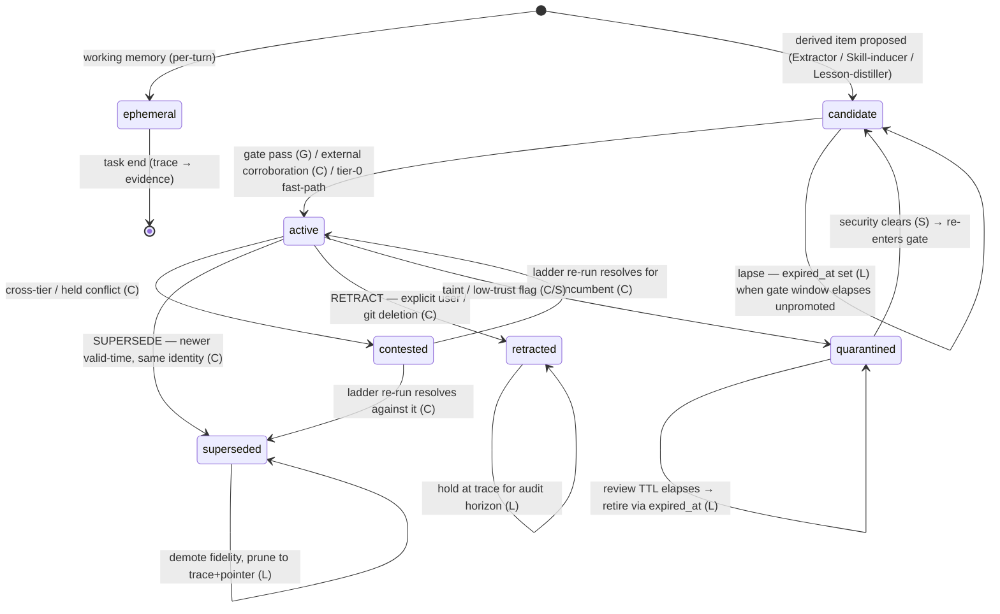

# Mnemosyne — Memory Lifecycle Policy

> **Lane scope.** This document defines **the lifetime of a memory entry — how it is created, updated, demoted in fidelity, expired, archived, and retired — as an explicit, total, auditable state contract over fields that already exist in the Build Blueprint.** It is the lifetime analogue of the Conflict-Resolution lane: that lane makes the *truth* decision contract explicit; this one makes the *lifetime* decision contract explicit. It is a policy, not a new subsystem — it adds no columns, no status values, and no stores.
>
> **What this lane does _not_ own (read those first):**
> - **Truth & merge decisions** (`Mnemosyne-Conflict-Resolution-and-Merge-Policy.md`; Blueprint **§6.3 / §21 belief-reviser / I2**). The operator set `ADD/UPDATE/SUPERSEDE/NOOP/CONTEST/QUARANTINE/RETRACT`, the precedence ladder, contradiction detection, cascade invalidation, and N-way merge are **theirs**. This lane never decides *what is true*; it decides *how long the system keeps holding and at what fidelity*, and it triggers re-examination — it never resolves a conflict.
> - **Erasure, PII classification, holds, access** (`Mnemosyne-Privacy-Redaction-Access-Policy.md`; Blueprint **§27 / §17.3 / I11**). `erased`, legal-hold, `sensitivity`, `trust_tier`, `capability_tags[]`, and the read predicate are theirs. Erasure is **not** a lifecycle event — it is a distinct, first-class, crypto-shred operation this lane *routes to and obeys*, never emulates with decay or pruning.
> - **Rollback & branch reversibility** (`Mnemosyne-Rollback-Guidance.md`; Blueprint **I3 / §30.6**). Every lifecycle pass runs on a branch and is reverted by discarding it; this lane produces rollback *surfaces* (S3 consolidation pass, S4 projection) but does not redefine the rollback primitives.
> - **Retrieval, ranking, abstention** (Blueprint **§22 / §26 / I8**). Retrieval *reads* `status` and `fidelity` and *writes* `last_accessed` / `access_count`; this lane *consumes* those usage signals to drive decay. It does not define channels, the activation weights, the U-curve, or the latency contract.
> - **Schema / data model** (Blueprint **§19 meta-envelope, §29 DDL, Appendix A**). Every field keyed on here — `status`, `fidelity`, `salience`, `valid_from/valid_to`, `recorded_at/expired_at`, `superseded_by`, `version`, `last_accessed`, `access_count` — **already exists**. This doc assigns *lifetime semantics and allowed transitions* to `status` and `fidelity`; it adds nothing.
> - **The optimizer rails** (Blueprint **§31**). `max_supersession_rate`, `min_corroboration_for_delete`, `max_prune_fraction_per_pass`, `monotonic_trust`, `consolidation_cadence_bounds` are immutable rails. This lane operates strictly *within* them and never widens them.
>
> If a sentence here starts to read like a truth decision, an erasure mechanism, a DDL change, a retrieval-ranking stage, or a rail change, it belongs in one of those lanes, not this one.

---

## 1. Position in the architecture

The Blueprint supplies the *machinery* of memory lifetime but leaves the *lifetime decision contract* implicit and scattered across §5.1, §10, §21, §22.4, and §25. This policy makes that contract explicit and total — exactly as the Conflict-Resolution lane did for the write-decision operators.

| Existing machinery | Where | What this policy adds |
|---|---|---|
| `status ∈ {active, candidate, superseded, contested, quarantined, retracted}` | §19 envelope | The **total transition relation** over those six values: who may enter each, on what trigger, with what guard |
| Fidelity ladder `verbatim → summary → gist → trace` | §25, I7 | The **demotion schedule** — *when* each step fires, the reconstructability guarantee per store, and the floors |
| Decay & salience (Ebbinghaus/ACT-R) | §10, §22.4, B.1 | The **decay-to-disposition map**: how a low base-level becomes demotion/eviction (and never a truth change) |
| Consolidation **Forgetter** pass | §21 | The **retention/TTL table** the Forgetter enforces, bounded by the §31 rails |
| Promotion gate (`validated_by`) + external corroboration | §8.3 | The **candidate lifetime** — how long a candidate may live before it lapses, and which promotion path applies per store |
| Bitemporal four timestamps | §19, I5 | The rule that lifecycle writes **transaction-time** disposition (`expired_at` on operational retirement) and **never valid-time** (`valid_to`) |
| Right-to-be-forgotten (transitive) | §27, §17.3 | The hand-off: lifecycle **invokes** erasure and recompute, and forbids decay/prune from ever standing in for it |

**One source of truth.** The evidence ledger (Store 2, append-only) is never expired, never pruned, and never status-transitioned — its only lifetime events are *lossless compaction* (`verbatim` drawer → `content_pointer`) and *erasure* (§27). All lifetime decisions with state in them operate on the **rebuildable projections** (Stores 3–8), so every lifecycle action is **recomputable from evidence** (Rollback P3/P4) and reversible-until-trace.

---

## 2. The three independent lifetime axes

A memory's lifetime is **not** one line. Three orthogonal axes evolve independently and compose; conflating them is the classic corruption source (e.g., using decay to bury a truth, or a TTL to fake an erasure). This lane owns Axis B and Axis C entirely, and the *time/usage-driven* transitions of Axis A.

```
Axis A — STATUS (validity / belief state)        ← shared with Conflict-Resolution
   candidate → active → {contested, superseded, retracted, quarantined}

Axis B — FIDELITY (representation / "archival")   ← owned here (Forgetter, §25)
   verbatim → summary → gist → trace   (+ retained pointer)

Axis C — RESIDENCY (where it lives / index cost)  ← owned here, reads retrieval's activation
   hot-indexed ↔ warm (present, de-indexed) ↔ cold (compressed / object store)
```

An entry can be `active` (Axis A) at `gist` fidelity (Axis B) evicted to `cold` (Axis C) — fully alive as current truth, cheaply stored, reconstructable on demand. **"Archived" is therefore a derived view, not a status:** `archived := fidelity ∈ {gist, trace} ∧ residency ≠ hot`. No `archived` enum value is introduced; it would violate the schema constraint.

---

## 3. Definitions

- **Live candidate.** `status = candidate ∧ expired_at IS NULL` — a derived proposal still inside its gate window.
- **Lapsed candidate.** `status = candidate ∧ expired_at IS NOT NULL` — a proposal that aged out of its gate window unpromoted. Filtered from retrieval; prunable; re-proposable from evidence. *No new status value is used — lapse is a transaction-time closure.*
- **Operational retirement.** Lifecycle stamps `expired_at` (transaction-time) on a **derived** item it is taking out of the held set for non-truth reasons (candidate lapse, projection prune). It is distinct from **supersession**, where Conflict-Resolution stamps `valid_to` *and* `expired_at` because the item stopped being true.
- **Compaction.** Lossless fidelity move of **evidence** verbatim drawer → `content_pointer` (AAAK-style compressed index). Byte-exact deep-mode reconstruction is preserved. This is the only fidelity event evidence ever undergoes.
- **Demotion.** Lossy fidelity move of a **derived** item (`verbatim→summary→gist→trace`). Recoverable only by re-derivation from (non-erased) evidence, never by an in-place "promote."
- **Pruning.** Deletion of a **derived projection row** (Stores 3–8) that is reconstructable from retained evidence + justifications. Bounded by `max_prune_fraction_per_pass` and `min_corroboration_for_delete`. **Never applies to evidence.**
- **Erasure.** §27 crypto-shred of evidence `content`; sets `erased=true`; propagates transitively. **Owned by Privacy; out of scope here except as a hand-off.**

---

## 4. The status state machine (Axis A)

The six values are the **existing** §19 enum. This policy fixes the legal transitions, the trigger, the owning lane, and the guard. **L** = this lifecycle lane, **C** = Conflict-Resolution, **G** = promotion gate / Eval, **S** = security (§27), **P** = privacy/erasure.



**Transition ownership table.** The column that matters: a transition is **owned by this lane only when its trigger is time or usage**; every truth-driven entry is owned by Conflict-Resolution and merely *scheduled* (cadence) here.

| From → To | Trigger | Owner | Guard / rail |
|---|---|---|---|
| ∅ → `candidate` | derived item proposed by a §21 pass | C (write-decision ADD) | `status=candidate`; on a branch |
| `candidate` → `active` | promotion gate passes (procedures/lessons/policies) | **G** | `validated_by` stamped; source disjoint from suite (§8.3) |
| `candidate` → `active` | external corroboration (facts) / tier-0 explicit user fact | C | corroborating tool/source; tier-0 fast-path skips gate |
| `candidate` → `candidate` **(lapsed)** | gate window TTL elapses unpromoted | **L** | stamp `expired_at`; never touch `valid_to`; prunable under rails |
| `active` → `contested` | cross-tier / held conflict detected | C | both retained (multi-hypothesis, I8) |
| `contested` → `active`/`superseded` | ladder re-run on new corroboration | C | **L schedules the revisit (cadence); C decides** |
| `active` → `superseded` | SUPERSEDE (newer valid-time, same identity) | C | closes `valid_to`+`expired_at`, links `superseded_by`; `max_supersession_rate` |
| `active` → `retracted` | explicit user retraction / git deletion | C | tier-0; cascade-invalidate dependents (I2) |
| any → `quarantined` | taint / low-trust at write | C/S | no influence on context until cleared |
| `quarantined` → `candidate` | security clears the taint | **S** | re-enters the gate |
| `quarantined` → retired | review TTL elapses, uncleared | **L** | `expired_at`; prunable under rails |
| any non-erased → `erased` | §27 forget request | **P** | crypto-shred; transitive; **not a lifecycle transition** |

**Invariants checkable by replay:**
1. No lane-`L` action ever writes `valid_to` or `superseded_by` (those are truth claims).
2. No lane-`L` action ever deletes evidence `content` (only §27 does).
3. A `contested` item is **never** closed by a lifecycle prune — its exit must carry a Conflict-Resolution *resolution record*, not a lifecycle *retirement record* (mirrors Conflict-Resolution §9.A invariant: *"lifecycle may prune or decay but may never silently resolve a CONTEST by deletion"*).

---

## 5. Creation rules (per store)

Creation is store-specific because the nine stores (§19) have different mutability. Birth fidelity is `verbatim` unless a pass emits a summary directly.

| Store | Born as | Path to durable/active | Notes |
|---|---|---|---|
| **1 Working memory** | ephemeral packet (no status) | never persisted | Per-turn Context-Compiler object (§5.1, §22.6). Completed slots evicted aggressively. Durable trace only via the logged trajectory (evidence). |
| **2 Evidence** | persisted, immutable, `verbatim` | n/a (raw source, not gated) | Append-only; `cid = sha256(content)` ⇒ dedup re-ingest is a NOOP (bumps `access`). Never `candidate`. |
| **3 Semantic / 4 Entity** | `status=candidate` | `active` via external corroboration (C); tier-0 user facts fast-path | Extractor/Resolver propose; belief-reviser admits. |
| **5 Procedural / 7 Corrective** | `status=candidate` | `active` **only** via promotion gate §8.3 (`validated_by`) | Skill-inducer / Lesson-distiller; the asymmetry rule (§23.7) makes this gate strict. |
| **6 Preference** | `status=candidate` (or tier-0 explicit) | scoped supersede; identity prefs durable | Temporary prefs carry a scope TTL; identity prefs get spaced rehearsal. |
| **8 Resource** | `status=candidate`, versioned | `active` on registration | Artifacts/files; lifetime tracks the owning projection. |

Creation always occurs **on a branch**; nothing is born directly on `main` (Rollback A4). The user-facing agent has **no write authority** — only the dedicated consolidator writes (§21, Letta safety split).

---

## 6. Update semantics — compile, don't overwrite

This lane inherits Conflict-Resolution §8's versioning invariant verbatim and extends it to non-truth updates:

1. **No in-place mutation of content or truth fields.** An update to *what an item asserts* is a new version via `UPDATE`/`SUPERSEDE` (owned by C): prior row closed (`valid_to`, `expired_at`), winner is a new row, `superseded_by`/`version` linked. Evidence is never updated at all (append-only).
2. **The lifecycle-writable field set.** Lifetime passes may write **only** these *operational* envelope fields in place, and only on the items/triggers shown — never the content, never the truth interval:

   | Field | Written in-place by this lane | On |
   |---|---|---|
   | `fidelity` | demotion (Forgetter) | utility/decay/age trigger |
   | `salience` | decay component | each consolidation pass |
   | `expired_at` | operational retirement of a **derived** item (candidate lapse, prune, quarantine-timeout) | TTL elapse |
   | `status` | **only** the L-owned transitions in §4 (candidate-lapse disposition, quarantine-timeout retirement) | TTL elapse |
   | residency metadata (index membership) | eviction / rebuild | activation below/above threshold |

   `last_accessed` / `access_count` are written by **retrieval** (on read), not here; this lane only *reads* them for decay. `calibrated_confidence` is owned by Metacognition (I8). `valid_to`, `superseded_by`, `version`, `justification_id` are owned by C / the belief core. `erased`, `sensitivity`, `trust_tier` are owned by P / §27.
3. **Idempotency.** Re-asserting identical content is a NOOP (dedup by `cid`); it refreshes usage signals but creates no version. Consolidation passes are ordered and idempotent (§21): replaying the same evidence under the same config yields the same dispositions.

---

## 7. Fidelity demotion — the archival axis (Axis B)

Demotion is **graduated, utility-driven, and reversible-until-trace** (§25, I7). The Forgetter pass (§21) applies it; this lane fixes the schedule, the per-store reconstructability guarantee, and the floors.

**Trigger.** Predicted future utility from a small model/heuristic (§25), proxied operationally by the ACT-R base-level (`ln Σ age(access_k)^−d`, `d≈0.5`, §22.4/B.1) modulated by `salience` and importance. Demotion fires when base-level falls below the per-tier threshold **or** the per-tier age TTL elapses with no access.

**Default schedule (tunable config, *not* a rail; scaled by salience and tightened by privacy class):**

| Step | Default dwell at low access | Reconstructable? |
|---|---|---|
| `verbatim → summary` | ~30 d | yes — from evidence |
| `summary → gist` | ~90 d | yes — from evidence |
| `gist → trace` | ~365 d | yes — from evidence |
| `trace` (floor) | indefinite; **pointer always retained** | yes — pointer ⇒ deep-mode reconstruction |

**Per-store guarantee.**
- **Evidence (Store 2):** only **lossless compaction** (`verbatim` drawer → `content_pointer`), and only as utility → 0. Byte-exact reconstruction is preserved. Evidence is **never** lossy-gisted and **never** pruned — this is the completeness guarantee (§1, §17.3).
- **Derived (Stores 3–8):** lossy demotion is allowed because the item is re-derivable from evidence. Even at `trace`, the pointer remains (compaction, not loss).

**Floors / exemptions.**
- **Spaced rehearsal** keeps must-keep memories (durable user/identity facts, validated skills) above a fidelity floor at expanding intervals (spacing effect, §25). They do not demote past `summary` while still `active`.
- **Privacy class floors (consumed, not set here).** Per `Mnemosyne-Privacy-Redaction-Access-Policy.md §4`, S2/S3 carry **shorter** retention and S3/S4 get **priority** disposition; this lane enforces those class-keyed defaults via the demotion/erasure schedule. Demotion must **never lower an item's `sensitivity` below the join of its evidence** (Privacy §1.3) — fidelity and sensitivity are independent.
- Fidelity only ever moves **down** by this lane. "Re-sharpening" happens by re-derivation from evidence (a fresh Summarizer/Embedder pass), never by editing a trace back up.

---

## 8. Expiration, TTL & retention rules

**TTL semantics — the load-bearing rule.** A TTL in this lane **never hard-deletes a memory and never closes valid-time.** Expiry maps to one of: (a) a fidelity demotion (Axis B), (b) eviction from hot indexes (Axis C), (c) `expired_at` transaction-time closure for a *derived operational retirement*, and (d) — only for a reconstructable derived row, and only within the rails — a prune. Hard deletion of *content* is reserved exclusively for §27 erasure. A TTL acting on `valid_to` would be a false claim that a fact stopped being true; that is structurally forbidden (§4 invariant 1).

**Retention table (recommended defaults — tunable within `consolidation_cadence_bounds`; *not* rails):**

| Subject | Default retention before next disposition | Disposition at TTL | Owner |
|---|---|---|---|
| Working memory | turn / sub-goal scope | evict completed slots; destroy at task end | L (§22.6) |
| Evidence (verbatim drawer) | until predicted utility ≈ 0 (e.g. ≥180 d cold + near-zero access) | **compact** verbatim → pointer (lossless); never delete | L Forgetter |
| Live candidate (derived) | gate window: **14 d or 3 consolidation passes** | stamp `expired_at` (lapse); prunable under rails; re-proposable | L + G |
| `active` fact / assertion | **no time TTL** (truth persists until superseded) | fidelity demotes per §7; never auto-retract | L (fidelity) / C (truth) |
| `active` procedure / skill / lesson | no time TTL; reflection-repetition retirement if repeatedly unhelpful (§26) | demote/retire low-`success_rate` via gate; spaced-rehearse validated must-keep | L + G |
| Preference — identity | durable | spaced rehearsal; change is a supersede (C) | L + C |
| Preference — temporary / scoped | scope bound (e.g. session / 30 d) | close at scope end (superseded) | L + C |
| `contested` | until resolved; **escalation TTL 7 d** | schedule ladder re-run / surface to user; keep multi-hypothesis | L schedules · C resolves |
| `superseded` | retained for as-of / audit | demote to `gist` ~30 d; `trace`+pointer ~1 y; prune under rails thereafter | L |
| `quarantined` | review window **30 d** | S clears → `candidate`; else retire (`expired_at`) under rails | S clears · L retires |
| `retracted` | audit horizon **~1 y** at `trace` | hold trace+pointer; re-derivable if premise returns | L |
| `erased` | terminal | crypto-shred content; retain salted hash + timestamps; propagate | **P / §27** |

**Bitemporal ownership at the seam.** `valid_from/valid_to` (valid time, *world truth*) are owned by Conflict-Resolution; `recorded_at` is set once at ingest; `expired_at` (transaction time, *system-held*) is written by **C on supersession** (truth end) **and by L on operational retirement** (candidate lapse, prune, quarantine timeout) — non-overlapping triggers. **L never sets `expired_at` on an `active` belief** (that would be a truth act).

---

## 9. Archival & storage tiering (Axis C)

"Archival" is residency + fidelity, not a status. Three tiers, all reconstructable:

- **Hot** — present in pgvector / FTS / graph indexes; on the fast path. Membership tracks activation (§22.4).
- **Warm** — present in tables but de-indexed from the hot path; reachable via deep mode. Eviction hot→warm is triggered when activation falls below threshold — **eviction is not deletion**; the row is intact and rebuildable (Rollback P4: rebuild from the ledger).
- **Cold** — compressed (`content_pointer`) / object-store; reconstructed on demand.

**Pruning of derived rows** (the only place a non-erasure row deletion happens) is the floor of Axis C and is hard-bounded:
- Only reconstructable derived projections (Stores 3–8); **never** evidence.
- Bounded by `max_prune_fraction_per_pass` (0.02) per pass and `min_corroboration_for_delete` (2) for any item being removed rather than demoted.
- Runs on a branch; transitively revertible (recompute along provenance, Rollback P3/P4).
- Pruning a `contested` participant is forbidden (§4 invariant 3); pruning a `superseded` record keeps its pointer so as-of-time queries still resolve.

**Erasure is not archival.** A cold/trace item is still fully reconstructable; an erased item is crypto-shredded and irrecoverable. A forget request routes to §27; this lane must never let demotion or prune *stand in for* erasure, nor let erasure be *simulated* by TTL (Conflict-Resolution §9.B: *"erasure is not supersession"* — symmetrically, erasure is not decay).

---

## 10. Loop ownership

Which of the three nested loops (§23) performs each lifetime action:

- **Hot loop (intra-task, seconds).** Emits `candidate` lessons/prefs and the logged trajectory. Evicts completed working-memory slots. Performs **no** durable status/fidelity changes.
- **Warm loop (idle "sleep-time").** The home of this lane. The §21 Forgetter decays salience, demotes fidelity, evicts/prunes within rails; the Replayer/Summarizer/Embedder refresh gist tiers and embeddings; the cadence re-examines `contested`/`quarantined` items at their TTL and hands resolution back to C / clearing back to S. Runs on a branch, gated, audited.
- **Cold loop (cross-task, days).** May **tune the defaults** in §7–§8 (dwell times, decay `d`, demotion thresholds, cadence) via PGO — **strictly within** the §31 rails, on canary branches through the gate. It never widens a rail and never edits the rails, the reward signal, or the verifier.

---

## 11. Rails compliance (the immutable invariant — §31, §23.5)

The lifetime contract lives entirely **inside** the rails; the cold loop tunes the §7–§8 defaults but can never cross these:

| Rail | How this lane stays within it |
|---|---|
| `max_supersession_rate: 0.05` | Lifecycle only *schedules* CONTEST revisits; the resulting supersessions are C's and are capped here. Lifecycle itself never supersedes. |
| `max_prune_fraction_per_pass: 0.02` | Hard cap on the Forgetter's prune step per pass; demotion/eviction (non-deleting) are not capped by it but are still branch-scoped. |
| `min_corroboration_for_delete: 2` | Any *removal* of a derived row (vs. demotion) requires ≥2 independent corroborations, or it is the §27 erasure path. Decay/demotion never "deletes," so this binds only pruning. |
| `consolidation_cadence_bounds: [5_steps, 24h]` | Bounds how often lifetime passes (and CONTEST/quarantine revisits) run. |
| `monotonic_trust: true` | Demotion/retirement may never be used to bury a higher-trust item — that would be a truth act, owned by C, and trust-gated there. |
| `reward_signal: external_only` · `untrusted_to_system_prompt: forbidden` | Unchanged; lifecycle reads them, never edits them. |

Every lifetime mutation is a **versioned, diffable, branch-scoped commit** (I3) appended to `audit_log` — so any lifetime pass is transitively revertible and reconstructable (Rollback P3/P4). A tripwire auto-rolls-back any pass that spikes mutation rate or the contradiction backlog (§23.5).

---

## 12. Boundaries restated (explicit hand-offs)

**A. Conflict-Resolution lane** (`Mnemosyne-Conflict-Resolution-and-Merge-Policy.md`).
- *They emit / own:* every truth transition — entry into `contested`, `superseded`, `retracted`; `valid_to`, `superseded_by`, `version`, the resolution record; cascade invalidation.
- *This lane owns:* the *schedule* on which flagged `contested`/`quarantined` items are revisited (cadence), and the demotion/prune/retention of every state **after** truth is settled.
- *Invariant at the seam (their §9.A, restated):* lifecycle **may prune or decay but may never silently resolve a CONTEST by deletion** — a contested exit must re-run their ladder and emit a fresh resolution record. Symmetrically, lifecycle never writes a truth field.

**B. Privacy / Erasure lane** (`Mnemosyne-Privacy-Redaction-Access-Policy.md`; §27 / §17.3).
- *They set:* `erased`, legal-hold, `sensitivity`, access policy, taint.
- *This lane reads* those flags: a legal-hold item is **exempt from demotion-to-prune and from retirement** until the hold lifts; an `erased` item is removed from candidacy and its solely-derived projections are recompute-or-dropped (§17.2). This lane **invokes** §27 for forget requests and **enforces** Privacy's class-keyed retention defaults — it never classifies, never crypto-shreds, never lifts a hold.
- *Invariant at the seam:* erasure ≠ decay. A TTL/prune is never recorded as, nor substituted for, an erasure, and vice-versa.

**C. Retrieval lane** (§22 / §26 / I8).
- *They write* `last_accessed` / `access_count` (on read) and consume `status`/`fidelity` for the read predicate (`active`/`candidate`/`contested` visible; `superseded` only via as-of; `quarantined`/`retracted`/`erased` excluded — see Privacy §3).
- *This lane reads* those usage signals to compute decay; it shares the ACT-R `base_level` term (retrieval ranks with it via `w_b`; lifecycle thresholds demotion on it) but **owns neither the ranking weights nor the abstention policy**.

**D. Rollback & gate** (`Mnemosyne-Rollback-Guidance.md`; §8.3). Lifetime passes are rollback **surfaces** S3 (consolidation pass) and S4 (projection) — reverted by discarding the branch and recomputing on provenance. The promotion gate decides `candidate → active`; this lane sets only how long a candidate may wait. Both are **invoked, not re-specified**.

---

## 13. Determinism & audit — acceptance criteria

A lifetime implementation conforms iff:
1. **No truth leakage.** No lane-L action writes `valid_to` or `superseded_by`; replay flags any occurrence as a regression.
2. **Evidence durability.** No lane-L action deletes or lossy-demotes evidence `content`; only §27 erasure removes it; compaction preserves byte-exact reconstruction.
3. **Idempotent passes.** Same evidence + same config ⇒ same `status`/`fidelity`/residency dispositions (Forgetter is a pure function of envelope + config).
4. **Contest integrity.** Every `contested` exit carries a Conflict-Resolution resolution record; no `contested` item is closed by a lifecycle retirement record.
5. **Rails honored.** Per-pass prune fraction ≤ 0.02; removals carry ≥2 corroborations or are erasures; pass cadence ∈ [5 steps, 24 h].
6. **Reversibility.** Every demotion/prune/retirement is a branch commit in `audit_log`; discarding the branch + recomputing on provenance restores the prior state (reversible-until-trace; trace keeps a pointer).
7. **As-of-time survives archival.** A `superseded` or demoted record still answers an as-of-T query at its retained fidelity (pointer minimum).

---

## 14. Worked examples

1. **Stale scrape, no truth change.** A tier-5 fact, unaccessed 200 d. Forgetter demotes `verbatim→gist`, evicts hot→cold; it stays `active`, surfaces only in deep mode, remains reconstructable. `valid_to` untouched — its truth never changed, only its cost.
2. **Unpromoted skill lapses.** Skill-inducer emits a `candidate` skill; the gate fails it twice; after 14 d / 3 passes lifecycle stamps `expired_at` (lapse). The row is prunable under the 0.02 rail, but the successful trajectory (evidence) is retained — so the skill is re-inducible later. No erasure, no truth claim.
3. **Superseded preference, archived but queryable.** C supersedes `theme=dark` with `theme=light` (closes `valid_to`+`expired_at`, links `superseded_by`). Lifecycle later demotes the `dark` record to `gist` (30 d) then `trace`+pointer (1 y). An as-of-2026-05 query still returns `dark`. Lifecycle never touches `valid_to`.
4. **Contested employer, scheduled not resolved.** A cross-tier CONTEST (tier-0 *Acme* vs tier-5 *Globex*) is flagged by C. Lifecycle schedules a revisit at 7 d; when new corroboration arrives it re-runs C's ladder. Lifecycle never deletes the loser to "tidy up" — that would breach §4 invariant 3.
5. **Erasure ≠ decay.** A user erases a source. Privacy/§27 crypto-shreds it and propagates; lifecycle's incremental recompute invalidates items derived *solely* from it and retains independently-corroborated ones. This runs on the erasure path, not the TTL/demotion path — the two are never interchanged.

---

## 15. Out of scope / open questions

- **Concrete TTL/dwell constants** here are *recommended defaults* owned as §31 **tunable** config, to be calibrated against the long-horizon degradation guard (§9 benchmark integrity). This lane fixes the *contract and which knob*, not the final numbers.
- **The predicted-future-utility model** (the demotion oracle) lives in §25/Forgetter; this lane specifies its *triggers, floors, and guarantees*, not the model's internals.
- **Spaced-rehearsal interval schedule** (expanding-interval shape) → tunable; only the *floor* behavior is fixed here.
- **Multi-tenant / global-memory GC and quota-pressure eviction order** defer to isolation (§27) and ops; this lane defines per-item lifetime, not cross-tenant capacity policy.
- **Working-memory slot-eviction policy** beyond "evict completed sub-goals aggressively" (§5.1, HiAgent) is the Context-Compiler's (§22.6); referenced, not redefined here.
```